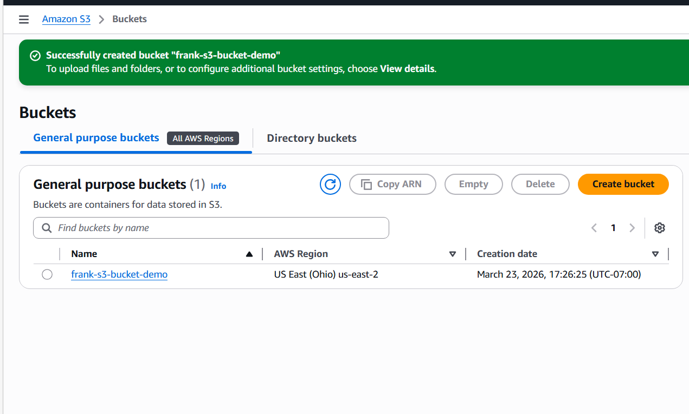
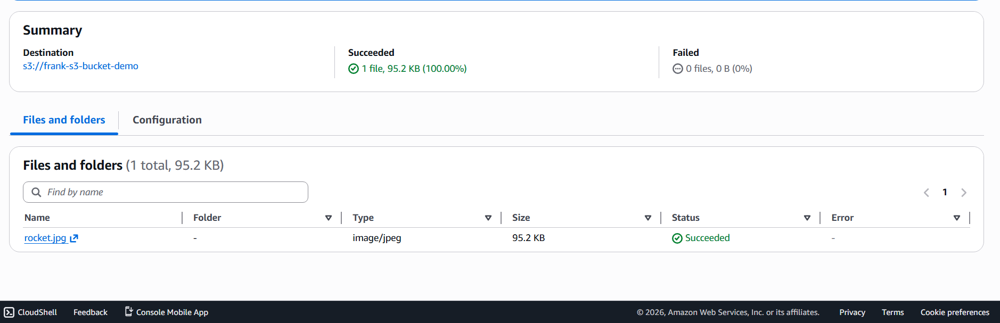
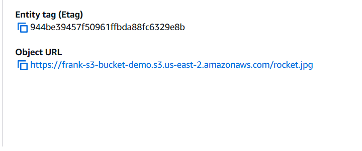

# AWS S3 Bucket Upload Project

## Project Overview
This project demonstrates how to create an Amazon S3 bucket and upload a file using the AWS Management Console.

## What I Did
- Created an S3 bucket with a globally unique name
- Selected the appropriate AWS region
- Configured bucket settings
- Uploaded an image file to the bucket
- Verified that the file was successfully stored in S3

## Technologies Used
- Amazon S3
- AWS Management Console

## Key Concepts Learned
- Cloud object storage
- Bucket and object structure in S3
- How to upload and manage files in the cloud

## Outcome
Successfully created a cloud storage bucket and uploaded a file, confirming that the object is accessible within the S3 environment.
## Screenshots

### S3 Bucket Created
I created a new S3 bucket using the AWS Management Console with a globally unique name.

### File Uploaded to S3
I uploaded an image file to the S3 bucket and verified that the object appears in the bucket.

### Object URL
I located the object URL for the uploaded file in Amazon S3.

### Access Control Test
I tested the object URL in the browser. The XML access denied response confirmed that Block Public Access was enabled and the object was not publicly accessible.

